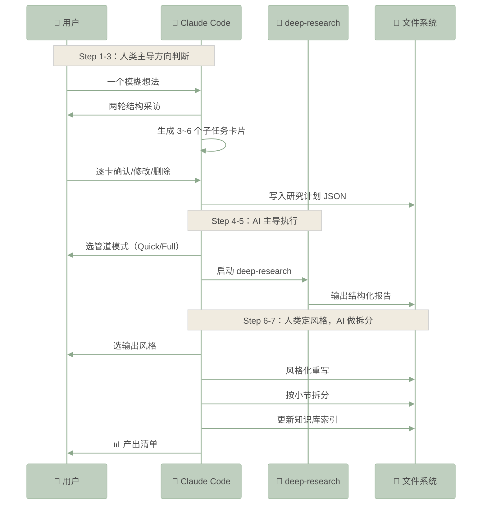

# research-flow

[](https://github.com/Suddennebbus/research-flow/releases/tag/v1.0.0)
[](https://creativecommons.org/licenses/by-nc/4.0/)

这是一个站在「人与AI协作平衡点」上的技能。

交互式深度调研技能，帮你把模糊想法拆解为结构化研究子任务，自动完成风格重写和内容知识库更新。


**亮点能力：**

1. 多轮采访帮你理清模糊想法
2. 结构化拆解为子任务卡片，用 deep-research 逐卡深入研究
3. 可选 Quick / Full 研究模式
4. 风格重写功能，帮你找到切入点（**风格重写无法代劳人类写作输出，你得自己写才有意义**）
5. 生长的内容知识库，成果分段自动拆分更新到你的内容知识库里


**30 秒安装**（Claude Code CLI / VS Code / JetBrains）：

```text
# 1. 装依赖：academic-research-skills（含 deep-research）
/plugin marketplace add Imbad0202/academic-research-skills
/plugin install academic-research-skills

# 2. 装 research-flow
git clone https://github.com/Suddennebbus/research-flow.git ~/.claude/skills/research-flow
```

然后输入 `/research-flow`，跟随结构化采访进入你的第一个深度调研

> **AI 是研究助理，不是研究员。** research-flow 不会替你判断什么方向值得深挖、什么论点经得起推敲。它管的是苦力活——搜索资料、编译报告、排版格式化——让你把脑子省下来做只有你能做的事：定方向、做取舍、判断什么东西有意思。
>
> 7 步里，前 3 步你说了算，中间 2 步 AI 干活，最后 2 步你定调子 AI 做苦力。每一步都有明确的"人机界线"——该你拍板的地方 AI 不越位，该 AI 批量处理的地方你不重复劳动。


### 为什么是人机协作，而不是全自动调研？

全自动调研管道的问题不是信息不够多——恰恰相反，信息太多了。管道不知道你真正想问什么，不知道这篇文章要写给谁看，不知道哪些细节值得深挖、哪些一笔带过。它像极度勤奋但缺乏上下文的研究助理——你丢给它一个主题，它给你搬来一座图书馆。

research-flow 的做法是把"人想清楚要什么"和"AI 高效执行"焊在一起。采访环节（Step 1-3）强制你在动手前把方向想清楚；子任务卡片给你逐卡确认的机会，删掉不感兴趣的、修改方向偏了的、保留真正想了解的；最后两步的风格选择和知识库拆分，确保调研成果能复用而不是烂在某个对话记录里。


---

## 架构 & 工作流

**👉 [SKILL.md](SKILL.md)** — 完整 7 步编排规范：状态变量、工具调用参数、分支处理、文件输出约定。



> 需要注意的是，风格重写无法代劳人类写作输出，重写仅提供参考


---

## 快速安装

**前置依赖**

- [Claude Code](https://docs.claude.com/en/docs/claude-code/setup)（最新版）
- `ANTHROPIC_API_KEY` 已配置
- [academic-research-skills](https://github.com/Imbad0202/academic-research-skills) v3.6.7+（提供 deep-research 管道）

**安装**

```text
# 1. 先装依赖
/plugin marketplace add Imbad0202/academic-research-skills
/plugin install academic-research-skills

# 2. 再装 research-flow
git clone https://github.com/Suddennebbus/research-flow.git \
  ~/.claude/skills/research-flow
```

**验证安装**

输入 `/research-flow`，描述一个你想调研的主题，开始结构化采访。

> ⚠️ 缺少 deep-research 时，SKILL.md 的 Step 5 前置校验会终止执行，并提示安装 academic-research-skills。

**手动安装（不用 plugin）**

```bash
# 1. 先装 deep-research
git clone https://github.com/Imbad0202/academic-research-skills.git \
  ~/.claude/skills/deep-research

# 2. 再装 research-flow（同上）
git clone https://github.com/Suddennebbus/research-flow.git \
  ~/.claude/skills/research-flow
```


***

## 亮点

- **结构化采访** — 两轮 AskUserQuestion，覆盖研究方向、目标读者、了解程度、特别关注，把模糊想法变成明确方向
- **子任务卡片机制** — 3~6 个独立子任务，每个带搜索策略和预期信息源，逐卡确认（执行/删除/修改），修改讨论最多 2 轮
- **deep-research 编排** — Quick（30 分钟简报）和 Full（完整研究报告）双模式，自动构造 prompt 和搜索语句
- **风格重写** — 长篇技术博客、论文专业解读、自定义，费曼学习法自检，**需要注意的是，风格重写无法代劳人类写作输出，重写仅提供参考**
- **mermaid 增强表达** — 所有结构化内容必须用 mermaid 呈现，根据语义自动选择图表类型（时序图/架构图/流程图/饼图），统一配色方案
- **知识库拆分** — 按小节拆分为独立 markdown 文件 + 维护 README 索引，支持跨调研项目的知识复用
- **参考资料标注** — 上标引用 `[^1]` + 文末列表，数据有出处，观点可追溯
- **只读区域保护** — `research/human-output/` 为只读区域，用户手写内容不会被 AI 覆写

---

## 项目结构

```
research-flow/
├── SKILL.md                    ← 核心：7 步编排规范
├── README.md                   ← 本文件
├── LICENSE                     ← CC BY-NC 4.0
├── CHANGELOG.md                ← 版本记录
└── references/
    ├── subtask-schema.json     ← 子任务 JSON Schema
    ├── mermaid-color-scheme.md ← 图表配色规范
    └── output-paths.md         ← 文件输出路径约定
```


---

## 使用

### 流程

```
/research-flow                           → 启动完整 7 步工作流

Step 1-3：你主导
  描述一个模糊想法 → 回答两轮采访 → 审阅子任务卡片 → 逐卡确认

Step 4-5：AI 执行
  选 Quick 或 Full 模式 → 管道自动运行

Step 6-7：你定调
  选输出风格 → AI 重写 + 拆分 + 更新索引 → 查看产出清单
```

### 产出文件

```
research/
├── plan/<topicSlug>.json              ← 研究计划
├── material/<topicSlug>-report.md     ← 管道原始报告
├── material/<topicSlug>-rewrite.md    ← 风格化重写
├── material/<topicSlug>-<section>.md  ← 小节拆分
└── material/README.md                 ← 知识库索引
```

详见 [references/output-paths.md](references/output-paths.md)

### 使用体验示例

### 1、布置任务

安装好skill后，你可以让你的Claude Code自行判断要不要使用`research-flow`，更推荐的是通过斜杠指令呼出来，更精准，比如，


### 2、让AI采访你

skill会根据任务情况拟几个问题问你，你们一起理清楚思路


### 3、基于采访内容生成子任务卡片，并逐项和你确认

每个子任务都会让你确认一下，以确保方向没跑偏，**这一步非常有必要，人类要主导**


### 4、选研究模式，Quick/Full

子任务全面确认完毕后，可以选一下研究模式，快速还是深入


我们选Quick模式示例一下

### 5、会参考积攒的内容知识库

**这里有一个亮点，大家可以看看，『内容知识库』，咱们这个技能可以积攒你自己的内容知识库，每次成果出来以后research-flow会自动把内容分段拆分为素材页面，供下次参考。**


### 6、风格重写

需要注意的是，**风格重写无法代劳人类写作输出，重写仅提供参考！**

可能没人喜欢看AI生成的内容，人味儿才是稀缺品


这里我们选论文专业解读风格

### 7、自动拆分更新你的内容知识库

这是这个skill最终产物，包含研究计划、报告、风格重写文档、拆分后的内容知识库，每一项都能用在点上，

**因为内容知识库的存在，你会越用越顺手，越用越懂你。**


---

## 兼容性

| research-flow | deep-research (academic-research-skills) |
|--------------|------------------------------------------|
| v1.0.0       | v3.6.7+                                  |

---

## 许可

本项目基于 [CC BY-NC 4.0](https://creativecommons.org/licenses/by-nc/4.0/)。

**你可以自由地：**
- 分享 — 复制和再分发
- 改编 — 修改、转换、基于此作品构建

**在以下条件下：**
- **署名** — 必须给出适当的署名
- **非商业** — 不得将本作品用于商业目的

**署名格式：**
```
Based on research-flow by sudden Deng
https://github.com/Suddennebbus/research-flow
```

本 Skill 依赖 [academic-research-skills](https://github.com/Imbad0202/academic-research-skills)，版权归 Cheng-I Wu 所有，同样基于 CC BY-NC 4.0。

---

## 贡献者

**sudden Deng** — 作者和维护者

**Cheng-I Wu** ([Imbad0202](https://github.com/Imbad0202)) — [academic-research-skills](https://github.com/Imbad0202/academic-research-skills) 作者，deep-research 管道的设计者和维护者。research-flow 的研究引擎层构建在该项目之上。

---

## Changelog

### v1.0.0 (2026-07-28)

- 7 步交互式深度调研工作流（采访 → 子任务生成 → 逐卡确认 → 合并选模式 → 执行研究 → 风格重写 → 拆分存储）
- 两轮结构化采访，覆盖研究方向、目标读者、了解程度、特别关注
- 子任务卡片 + 逐卡确认机制（执行/删除/修改，修改最多 2 轮）
- deep-research 管道编排（Quick / Full 双模式）
- 6 种风格重写 + 费曼学习法自检
- 强制 mermaid 图表 + 统一配色规范
- 小节拆分 + 知识库索引
- 参考资料标注系统
- 只读区域保护
- 依赖检测前置校验
